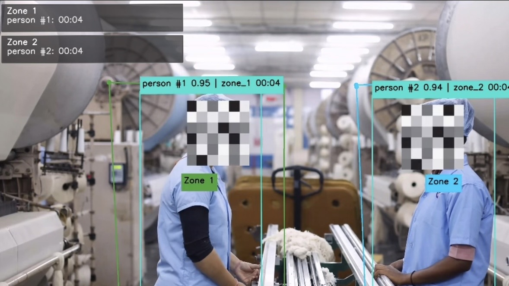

# Person Zone Tracking

A production-oriented Python computer vision project for tracking selected object classes inside user-defined polygon zones and calculating dwell time per zone, class, and track ID.

The project supports webcam input, video file input, YOLO detection with persistent Ultralytics tracking, multi-zone polygon membership, dwell time analytics, OpenCV overlays, and optional output video saving.

> This repository does not include model weights, videos, generated outputs, logs, or Git metadata.

---

# Demo

Youtube Demo: [Watch the demo](https://www.youtube.com/watch?v=JkBRFS-tjHM)

---

## Overview

`person-zone-tracking` is designed for zone-based object monitoring using computer vision.

The system detects selected object classes, assigns persistent tracking IDs, checks whether each tracked object is inside user-defined polygon zones, and calculates how long each object stays inside each zone.

Typical use cases include:

- Person dwell-time monitoring
- Restricted-area monitoring
- Safety-zone monitoring
- Helmet or equipment presence monitoring
- Multi-zone object activity analysis
- Camera-based behavior or movement tracking

---

## Zone Tracking Example



---

## Key Features

| Feature | Description |
|---|---|
| Webcam and video input | Supports both live webcam streams and video files |
| YOLO detection | Uses Ultralytics YOLO for object detection |
| Persistent tracking | Uses YOLO `track(..., persist=True)` to maintain object identities across frames |
| Multi-zone support | Supports multiple user-defined polygon zones |
| Flexible polygon shapes | Each zone can contain any number of polygon points |
| JSON zone storage | Zones can be saved to and loaded from JSON files |
| Configurable classes | Target classes can be configured, such as `person`, `helmet`, or other custom model classes |
| Dwell-time analytics | Calculates time spent inside each zone per class and track ID |
| OpenCV visualization | Draws bounding boxes, class names, confidence scores, track IDs, zones, dwell time, and zone summaries |
| Output video saving | Can optionally save the processed video |
| Flexible configuration | Supports command-line arguments, YAML config, and safe default values |
| Deployment flexibility | YOLO models can be exported to deployment formats such as ONNX, OpenVINO, TensorRT, CoreML, TFLite, NCNN, and RKNN |

---

## Processing Pipeline

```text
Video or Webcam Input
        ↓
YOLO Object Detection
        ↓
Persistent Object Tracking
        ↓
Polygon Zone Matching
        ↓
Dwell Time Calculation
        ↓
Visualization and Optional Output Saving
```

Dwell time is tracked independently using the following structure:

```text
zone_id -> class_name -> track_id
```

Example:

```text
zone_1
└── person
    ├── track_id_1 -> 12.4 seconds
    └── track_id_2 -> 7.8 seconds

zone_2
└── helmet
    └── track_id_5 -> 4.2 seconds
```

This structure allows the system to separate dwell records by zone, class, and individual tracked object.

---

## Folder Structure

```text
person-zone-tracking/
├── README.md
├── requirements.txt
├── .gitignore
├── configs/
│   └── app.yaml
├── assets/
│   └── sample_zones.json
├── data/
│   ├── videos/
│   │   └── .gitkeep
│   └── outputs/
│       └── .gitkeep
├── models/
│   └── .gitkeep
├── src/
│   ├── main.py
│   ├── config.py
│   ├── video_source.py
│   ├── detector.py
│   ├── tracker.py
│   ├── zone_editor.py
│   ├── zone_manager.py
│   ├── dwell_time.py
│   ├── visualizer.py
│   └── utils.py
└── tests/
    └── .gitkeep
```

---

## Installation

Create and activate a Python virtual environment, then install the required dependencies.

```bash
pip install -r requirements.txt
```

Place your YOLO model weights inside the `models/` directory.

Example:

```text
models/best.pt
```

You can also pass a custom model path using `--model-path`.

This project intentionally does not download YOLO weights automatically. If the model file is missing, the application exits with a clear error message.

---

## Usage

Run all commands from the project root directory.

### Run with Webcam

```bash
python src/main.py --source-type webcam --camera-id 0 --model-path models/best.pt --conf 0.3 --classes person helmet
```

### Run with Video File

```bash
python src/main.py --source-type video --source-path "D:/videos/test.mp4" --model-path models/best.pt --conf 0.3 --classes person helmet
```

### Draw Zones

```bash
python src/main.py --source-type video --source-path "D:/videos/test.mp4" --draw-zones true --zones-path assets/zones.json
```

### Save Output Video

```bash
python src/main.py --source-type video --source-path "D:/videos/test.mp4" --model-path models/best.pt --zones-path assets/zones.json --save-output true --output-path data/outputs/result.mp4
```

### Run with YAML Config

```bash
python src/main.py --config configs/app.yaml
```

---

## Configuration Priority

Configuration values are resolved in the following order:

| Priority | Source | Description |
|---|---|---|
| 1 | Command-line arguments | Highest priority; overrides all other values |
| 2 | YAML config | Values from `configs/app.yaml` |
| 3 | Safe defaults | Hardcoded default values used when no config is provided |

---

## Supported Command-Line Arguments

| Argument | Description |
|---|---|
| `--config` | Path to YAML configuration file |
| `--model-path` | Path to YOLO model weights |
| `--conf` | Detection confidence threshold |
| `--iou` | IoU threshold |
| `--classes` | Target classes to detect and track |
| `--source-type` | Input source type: `webcam` or `video` |
| `--source-path` | Path to input video file |
| `--camera-id` | Webcam camera index |
| `--zones-path` | Path to zone JSON file |
| `--draw-zones` | Open the zone editor |
| `--save-output` | Save processed output video |
| `--output-path` | Path for saved output video |
| `--device` | Inference device |
| `--imgsz` | YOLO inference image size |
| `--display` | Show or hide the OpenCV display window |

Boolean arguments accept values such as:

```text
true, false, yes, no, 1, 0
```

---

## YAML Config Example

Edit `configs/app.yaml` to set default values that you do not want to pass every time.

```yaml
model_path: models/best.pt
conf: 0.30
iou: 0.50
target_classes:
  - person
  - helmet
source_type: webcam
camera_id: 0
source_path: data/videos/input.mp4
zones_path: assets/sample_zones.json
draw_zones: false
save_output: false
output_path: data/outputs/result.mp4
display: true
device: auto
imgsz: 640
tracker_config: bytetrack.yaml
```

Relative paths are resolved from the project root directory.

---

## Zone JSON Format

Zones are stored in JSON format.

```json
{
  "version": 1,
  "zones": [
    {
      "id": "zone_1",
      "name": "Zone 1",
      "points": [
        [447, 119],
        [836, 118],
        [843, 439],
        [437, 439],
        [443, 121]
      ],
      "target_classes": [
        "person"
      ]
    }
  ]
}
```

Each polygon must have at least three points.

If `target_classes` is omitted or empty for a zone, the global target classes are used.

---

## Zone Membership Logic

Zone membership uses class-agnostic bounding box matching.

A detection is considered inside a zone when at least one of the following conditions is true:

1. The bounding box center point is inside the polygon.
2. The bounding box and zone overlap ratio reaches the adaptive threshold for that bounding box size.

Bounding box center point:

```text
center_x = (x1 + x2) / 2
center_y = (y1 + y2) / 2
```

Adaptive overlap thresholds:

| Bounding Box Area | Overlap Threshold |
|---|---|
| `< 5,000 px` | `0.05` |
| `< 25,000 px` | `0.10` |
| `>= 25,000 px` | `0.20` |

---

## Zone Drawing Controls

When the zone editor opens, use the following controls:

| Control | Action |
|---|---|
| Left click | Add a point |
| Right click | Finish current polygon |
| Enter | Finish current polygon |
| N | Start a new zone |
| S | Save zones to JSON |
| R | Reset all zones |
| Q or Esc | Exit editor |

If the configured zones file is missing, or `--draw-zones true` is passed, the application opens the zone editor using the first frame from the selected source.

---

## Runtime Behavior

| Case | Behavior |
|---|---|
| Video file input | Dwell timestamps use `frame_index / fps` |
| Webcam input | Dwell timestamps use `time.time()` |
| Track leaves a zone | Dwell accumulation stops |
| Track re-enters the same zone | Dwell time continues from the previous total |
| Multiple zones | Dwell time is calculated independently per zone |
| Multiple classes | Dwell time is calculated independently per class name |
| Multiple track IDs | Dwell time is calculated independently per tracked object |
| Detection without tracking ID | Detection is displayed, but dwell time is skipped |

---

## Model Export Recommendations

The default `.pt` model is suitable for development, testing, and quick iteration with Ultralytics. For deployment on other devices, export the trained YOLO model to a format that matches the target hardware and runtime.

The export format recommendations in this section are based on the official Ultralytics YOLO export documentation.

Reference: [Ultralytics YOLO Export Documentation](https://docs.ultralytics.com/modes/export/#export-formats)

According to the official Ultralytics documentation, YOLO models can be exported to multiple deployment formats, including ONNX, OpenVINO, TensorRT, CoreML, TensorFlow SavedModel, TensorFlow Lite, Edge TPU, TF.js, PaddlePaddle, MNN, NCNN, RKNN, and other runtime-specific formats.

Ultralytics also recommends ONNX or OpenVINO for CPU acceleration and TensorRT for GPU acceleration, depending on the target hardware.

### Recommended Export Formats by Device

| Target Device or Runtime | Recommended Format | When to Use |
|---|---|---|
| Development or testing with Ultralytics | `.pt` | Best for development, debugging, and quick iteration |
| General cross-platform deployment | ONNX | Good general-purpose export format for running outside the Ultralytics Python workflow |
| CPU-only machine | ONNX | Good first export choice for general CPU inference |
| Intel CPU or Intel iGPU | OpenVINO | Recommended when deploying on Intel hardware |
| NVIDIA GPU | TensorRT `.engine` | Recommended for high-speed GPU inference |
| NVIDIA Jetson | TensorRT `.engine` | Recommended for edge deployment on Jetson devices |
| Apple macOS or iOS | CoreML | Recommended for Apple ecosystem deployment |
| Android or lightweight edge devices | TFLite or NCNN | Recommended for mobile or lightweight edge inference |
| Google Coral Edge TPU | Edge TPU TFLite | Recommended when using Coral Edge TPU hardware |
| Rockchip-based boards | RKNN | Recommended for Rockchip NPU deployment |

### Export Examples

Export to ONNX:

```bash
yolo export model=models/best.pt format=onnx imgsz=640
```

Export to OpenVINO:

```bash
yolo export model=models/best.pt format=openvino imgsz=640
```

Export to TensorRT:

```bash
yolo export model=models/best.pt format=engine imgsz=640 device=0
```

Export to TensorRT with FP16:

```bash
yolo export model=models/best.pt format=engine imgsz=640 half=True device=0
```

Export to TensorRT with INT8 calibration:

```bash
yolo export model=models/best.pt format=engine imgsz=640 int8=True data=data.yaml device=0
```

Export to CoreML:

```bash
yolo export model=models/best.pt format=coreml imgsz=640
```

Export to TFLite:

```bash
yolo export model=models/best.pt format=tflite imgsz=640
```

Export to NCNN:

```bash
yolo export model=models/best.pt format=ncnn imgsz=640
```

Export to RKNN:

```bash
yolo export model=models/best.pt format=rknn imgsz=640
```

### Practical Recommendation

For this project, the recommended deployment path is:

| Situation | Recommended Choice |
|---|---|
| Testing on PC | Use `.pt` directly |
| Running on CPU-only machine | Export to ONNX first |
| Running on Intel CPU | Export to OpenVINO |
| Running on NVIDIA GPU | Export to TensorRT |
| Running on NVIDIA Jetson | Export to TensorRT on the Jetson device |
| Running on mobile or small edge hardware | Export to TFLite or NCNN |

In most cases, start with `.pt` during development. After the pipeline is stable, export the model for the target device and benchmark the real FPS, latency, memory usage, and detection quality.

Do not choose an export format only because it is available. Choose the format based on the actual deployment hardware.

TensorRT engine files are hardware-specific and should usually be built on the same target device or a compatible NVIDIA GPU environment.

Exported models may require different inference code, preprocessing, post-processing, or runtime dependencies depending on the selected format.

---

## Limitations

- Tracking quality depends on the YOLO model, camera angle, frame rate, object occlusion, and tracker configuration.
- The sample zone file is only a placeholder. Draw zones for your actual camera or video scene.
- Helmet detection requires a model trained with a `helmet` class.
- Very crowded scenes may require adjusted confidence, IoU, image size, or tracker settings.
- Detections without persistent tracking IDs cannot be used for dwell-time accumulation.
- Exported models may require different inference code, preprocessing, post-processing, or runtime dependencies depending on the selected format.
- TensorRT engine files are hardware-specific and should usually be built on the same target device or a compatible NVIDIA GPU environment.

---

## Future Improvements

- Export dwell analytics to CSV or JSON.
- Add per-zone entry and exit event logs.
- Add a small dashboard for historical summaries.
- Add automated tests for config parsing, zone validation, and dwell-time updates.
- Add benchmark scripts for exported model formats such as ONNX, OpenVINO, and TensorRT.
- Support separate tracker configuration files per deployment.

---

## Notes

This project is structured for practical computer vision experimentation and deployment-style development.

The main goal is not only to detect objects, but also to convert detection and tracking results into zone-based time analytics that can be used for monitoring, reporting, or downstream decision logic.

For deployment, always test the exported model on the actual target device. Export format alone does not guarantee real-world performance. Camera resolution, FPS, preprocessing, post-processing, tracker configuration, and hardware acceleration all affect the final system speed.